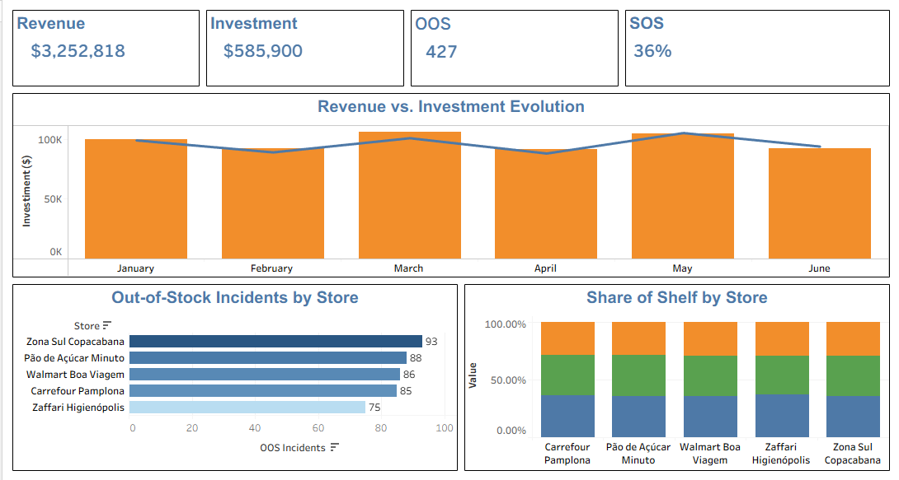

# 📊 Trade Marketing Execution Dashboard

## 📌 Project Overview

The Trade Marketing Execution Dashboard was developed to simulate a real-world Trade Marketing monitoring solution using Tableau.

The dashboard provides visibility into key execution metrics such as Out-of-Stock incidents, Share of Shelf performance, investment allocation, and revenue evolution, enabling data-driven decisions for field execution and retail performance improvement.

---

## 🎯 Business Problem

Trade Marketing teams often struggle to monitor execution quality across multiple retail locations.

Without centralized visibility, it becomes difficult to identify:

- Stores with high Out-of-Stock occurrences
- Shelf space performance by location
- Investment effectiveness
- Revenue trends over time

This dashboard was designed to provide a clear and actionable view of these critical metrics.

---

## 💡 Business Solution

The solution consolidates Trade Marketing execution indicators into a single interactive Tableau dashboard.

Users can:

- Monitor Out-of-Stock incidents by store
- Analyze Share of Shelf performance
- Compare investment versus revenue evolution
- Track key execution KPIs
- Identify stores requiring immediate action

---

## ❓ Business Questions

The dashboard was built to answer the following questions:

- What is the total revenue generated?
- How much investment was allocated?
- How many Out-of-Stock incidents occurred?
- What is the average Share of Shelf performance?
- Which stores have the highest Out-of-Stock rates?
- How does revenue evolve compared to investment?
- How does shelf share vary across stores?

---

## 📈 Key Performance Indicators (KPIs)

| KPI | Value |
|------|------|
| Revenue | $3,252,818 |
| Investment | $585,900 |
| OOS Incidents | 427 |
| Shelf Share | 36% |

---

## 📊 Dashboard Features

### Revenue vs. Investment Evolution
Tracks monthly revenue performance against investment levels.

### Out-of-Stock Incidents by Store
Identifies stores with the highest occurrence of stock shortages.

### Share of Shelf by Store
Compares shelf space distribution between the company brand and competitors.

### Executive KPI Cards
Provides a quick overview of the most important business metrics.

---

## 🛠️ Technologies Used

- Tableau Public
- Microsoft Excel / CSV
- Data Visualization
- Trade Marketing Analytics
- Business Intelligence

---

## 📂 Repository Structure

```text
Trade-Marketing-Execution-Dashboard
│
├── Dashboard
│   └── Trade-Marketing-Execution-Dashboard.twbx
│
├── Data
│   └── Dados_Trade.csv
│
├── Images
│   └── dashboard-preview.png
│
└── README.md
```

---

## 🖼️ Dashboard Preview



---

## 🔍 Key Insights

- Zona Sul Copacabana recorded the highest Out-of-Stock incidence rate.
- Revenue remained relatively stable throughout the analyzed period.
- Shelf Share performance was consistent across stores.
- Investment levels showed a direct relationship with revenue evolution.
- Execution indicators can help prioritize corrective actions in retail locations.

---

## 🎓 What I Learned

Through this project, I improved my skills in:

- Tableau Dashboard Design
- KPI Development
- Trade Marketing Analytics
- Data Storytelling
- Data Visualization Best Practices
- Executive Dashboard Creation

---

## 🚀 Future Improvements

- Add regional filters
- Include trend analysis by product category
- Create store-level drill-down views
- Implement interactive dashboard actions
- Expand competitor benchmarking metrics

---

## 🔗 Live Dashboard

View the interactive Tableau dashboard:

[Trade Marketing Execution Dashboard](https://public.tableau.com/app/profile/marcos.rogerio5761/viz/Trade-Marketing-Execution-Dashboard/Trade-Marketing-Execution-Dashboard)

---

## 👨🏾‍💻 Author

**Marcos Rogério da Silva**

Trade Marketing | Business Intelligence | Data Analytics

### Connect with me

- GitHub: https://github.com/marcosrdevbr
- LinkedIn: https://www.linkedin.com/in/marcos-rogerio-017923302/

Feel free to connect or share feedback about this project.

---

## ⭐ If you found this project interesting

If you enjoyed this project or found it useful, feel free to connect with me on LinkedIn or explore my other repositories on GitHub.

Thank you for visiting my portfolio!
